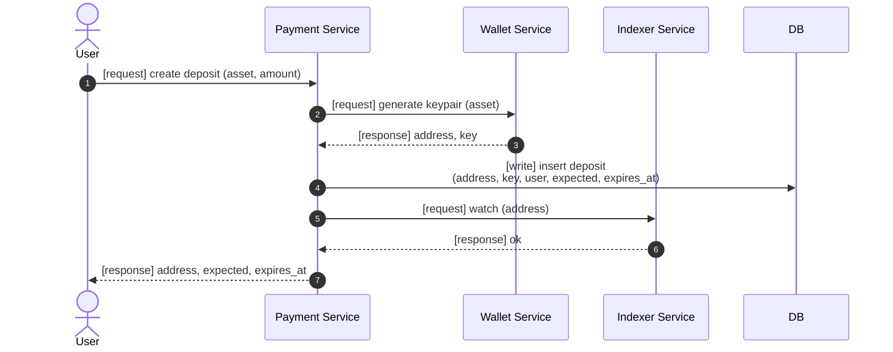
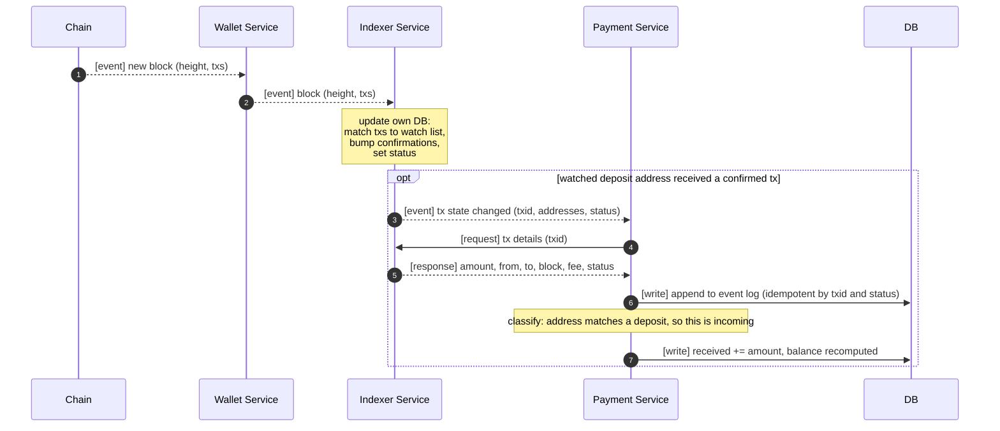
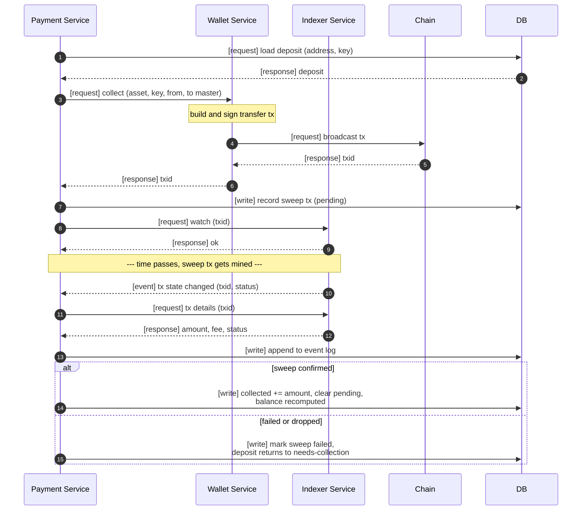
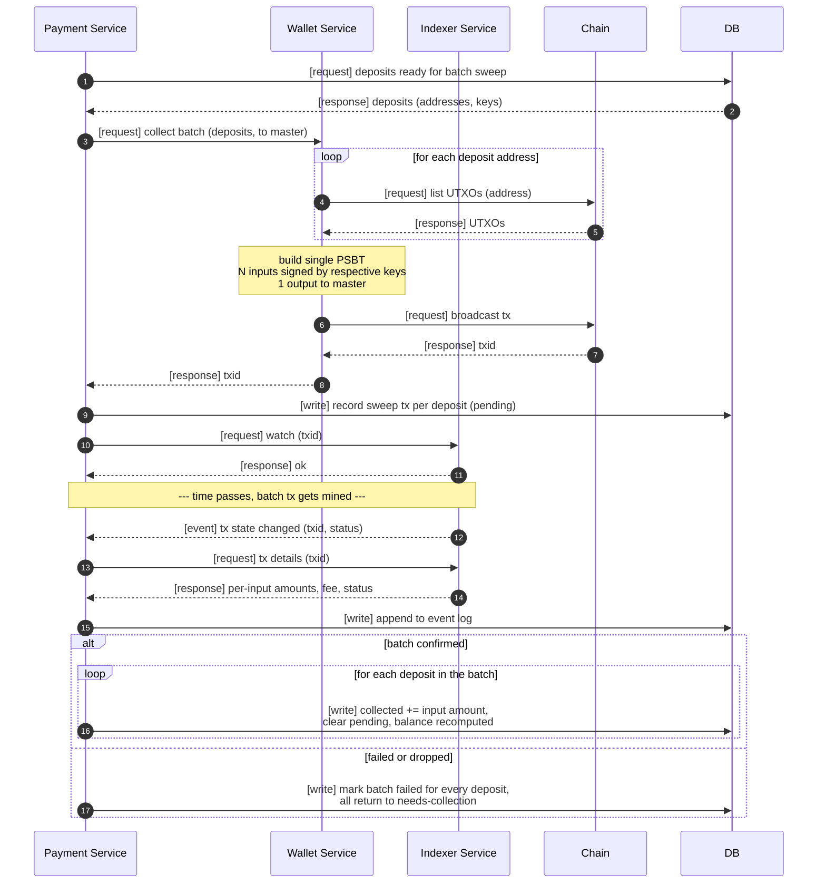
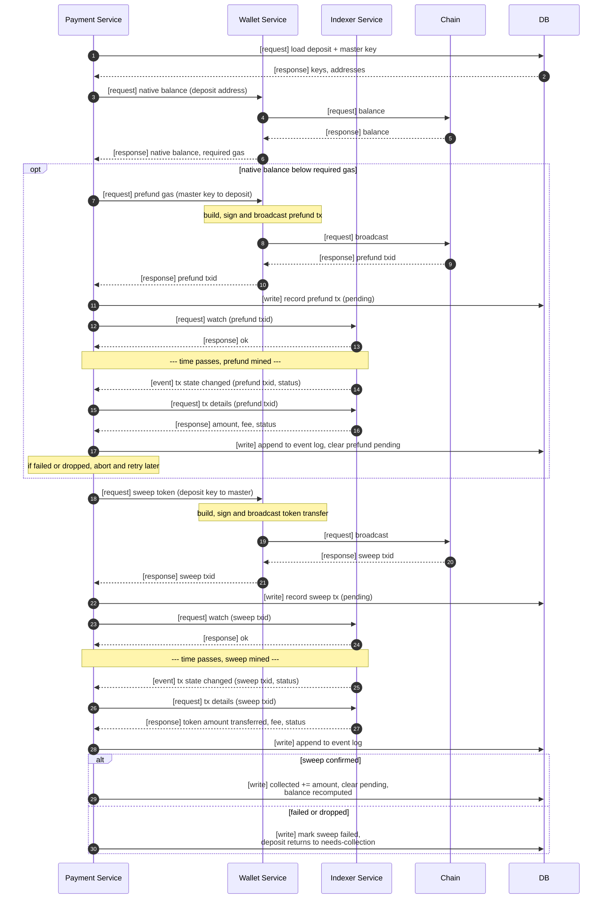

# Crypto Deposit System — Redesign

https://github.com/trezor/blockbook
https://github.com/vsys-host/shkeeper.io

DO research about similar projects.

----

Three independent flows:

1. **Deposit address generation** — identical for every asset.
2. **Observation (indexing)** — Indexer watches chain, dispatches events on state changes, answers queries.
3. **Collection** — moves funds from deposit addresses to master. Three modes: wallet-based, UTXO, ERC-20.

## Components

- **Payment Service (PS)** — user-facing. Owns deposits and accounting. Two internal layers on top of its own DB:
  - *Event log* — append-only mirror of observations received from IX.
  - *Accounting ledger* — `deposit` counters (`received`, `collected`, `balance`, `accounted`) derived from the event log via classification.
- **Wallet Service (WS)** — stateless chain adapter. Per-asset factory implementing the `IWallet` surface: generate keypair, read balance, build/sign/broadcast transfers, collect from another wallet (per-chain strategy lives here), stream blocks. No DB.
- **Indexer Service (IX)** — independent service with its **own separate DB** (watch list + observed tx state). Consumes the block stream, tracks each observed tx's state (confirmed / failed / dropped / reorged) with actual transferred amounts. Exposes:
  - `watch(address)` / `watch(txid)` — register interest
  - `txs(address)` — query all observed txs for an address
  - `tx(txid)` — query a single tx's parsed details (amount, from, to, status, block, fee)
  - dispatches events when a watched item reaches a state transition
  - IX emits **facts** only — `(txid, addresses, amounts, status)`. It does **not** classify txs as "incoming" or "sweep" — that's PS's job.
- **DB (PS)** — persistence owned exclusively by PS. Holds the event log and accounting ledger. Distinct from IX's storage.
- **Chain** — blockchain RPC / node.

### Deposit accounting fields

The `deposit` row tracks four monetary counters. Each has exactly one trigger:

| Field | Meaning | Updated when |
|-------|---------|--------------|
| `received` | Total crypto that ever arrived at the deposit address (monotonic) | IX event: incoming tx confirmed at deposit address |
| `balance` | Current on-chain balance at the deposit address | IX event: any tx involving the deposit address (incoming or sweep) |
| `collected` | Total crypto actually swept to master | IX event: sweep tx confirmed |
| `accounted` | Total credited to user (business ledger) | PS internal decision, bounded by `received` |

Invariant: `received ≈ balance + collected` (drift only from dust / fees).

### Separation of concerns

- **IX** holds raw tx observations in its own DB. It knows nothing about deposits, users, or sweep-vs-incoming semantics. Facts only.
- **PS** owns the event log (append-only mirror of relevant IX observations) and the accounting ledger (derived projection). Classification — "is this a sweep of mine or an incoming deposit?" — happens in PS by consulting its own records.
- **WS** holds no state. Each call is one operation: generate, read, broadcast, collect.

### Arrow tags

- `[request]` — synchronous call expecting an answer
- `[response]` — answer to a request
- `[event]` — subscription / push
- `[write]` — DB mutation

Interfaces are semantic, not HTTP. Whether an arrow crosses process boundaries is an implementation choice.

---

## 1. Deposit Address Generation

Keypair is derived inside WS. PS persists the deposit and registers the address with IX so incoming txs start being tracked immediately.

---

## 2. Observation (Incoming Deposits)

IX consumes blocks and dispatches state-change events for anything on its watch list. This flow shows the **incoming** path — a user's funding tx arriving at a deposit address. Sweep outcomes are shown in flow 3 so each collection diagram reads end-to-end.

The `accounted` counter is not updated here. PS bumps it in its own business flow when it decides to credit the user — typically triggered by `received` growing — bounded by `accounted ≤ received`.

---

## 3. Collection

PS decides *when* to sweep based on `received - collected - accounted` from flow 2. WS knows *how* per asset. Every broadcast is followed by `watch(txid)` so the outcome (and `collected` update) comes back via flow 2.

### 3a. Wallet-based (ETH / SOL)

Single signed transfer from deposit address to master. Broadcast now, `collected` updates when the sweep tx is observed by IX.

### 3b. UTXO (BTC)

Batched. N deposits collapse into one transaction: N inputs (each signed by its own deposit key) → 1 output to master. One txid resolves the whole batch.

### 3c. ERC-20 (smart-contract token)

Two transactions: gas prefund from master, then token sweep from deposit. PS waits for each to be observed before continuing.

---

## Design Notes

- **Wallet Service is stateless and owns collection strategy.** Per-chain wallet factories (`IWallet`) already know how to collect from another wallet — splitting that out into a separate service would be artificial layering.
- **Indexer Service is the single source of truth for on-chain observations, not for business semantics.** IX emits raw facts `(txid, addresses, amounts, status)`. Classification (sweep vs incoming, which deposit it belongs to) happens in PS. IX has its own separate DB and never writes to PS's.
- **PS has two persistence layers on one DB.** An append-only event log mirrors observations received from IX (facts). An accounting ledger projects those facts onto deposit counters. The projection can be rebuilt from the log.
- **Keys live with Payment Service.** Encryption / KMS / plaintext is an orthogonal decision not captured here.
- **PS dedupes.** IX can legitimately replay events (restart, reorg recovery). PS's ledger (which txids have already been applied to a counter) ensures idempotency.
- **Every counter has exactly one trigger.** `received` ← incoming confirmed; `collected` ← sweep confirmed; `balance` ← derived; `accounted` ← PS business decision. No counter is ever written at broadcast time — broadcasts only create *pending* tx records.
- **Failure modes surface uniformly.** `failed`, `dropped`, `reorged` all arrive as events through flow 2. ERC-20 prefund-confirmed-but-sweep-dropped does not strand funds silently — PS observes the failure and retries.
- **Sweep confirmation is not a second listener.** The same flow-2 pipeline that observes incoming deposits observes outgoing sweeps. One loop per chain.
