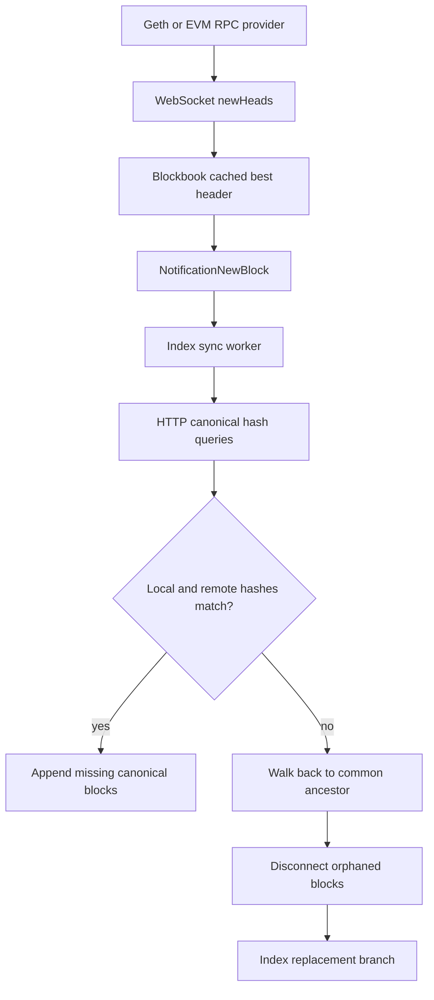

# Ethereum Reorganization Notifications and Blockbook Integration

**Research date:** July 17, 2026

**Scope:** go-ethereum RPC subscriptions, Ethereum consensus-layer reorg events,
emerging standards, and the current Blockbook EVM synchronization design.

## 1. Purpose

This document investigates whether go-ethereum (Geth) implements a dedicated
RPC subscription for chain reorganizations, particularly the feature requested
in [go-ethereum issue #26953](https://github.com/ethereum/go-ethereum/issues/26953).

It also documents:

- Which Geth subscription mechanisms currently expose reorg-related data.
- How a consumer can reliably detect and recover from a reorg.
- The explicit `chain_reorg` event available from Ethereum consensus clients.
- The status of proposed transaction-level reorg subscriptions.
- How the current Blockbook code detects and processes EVM reorganizations.
- Which changes could improve latency and observability without weakening
  correctness or cross-chain compatibility.

## 2. Research Conclusion

Geth does **not** currently expose a dedicated execution-layer subscription
named `reorg`, `reorgs`, `reorgHeads`, or an equivalent RPC method.

Issue #26953 remains open and has no linked pull request, milestone, or merged
implementation. Current Geth releases and the current master source continue to
expose `newHeads` as the primary chain-head subscription. Reorgs are reflected
through that stream, but the subscriber must identify them.

The practical execution-layer model remains:

1. Subscribe to `newHeads` over WebSocket or IPC.
2. Treat each notification as a signal that canonical state may have changed.
3. Compare the received or queried canonical block hashes with locally stored
   hashes.
4. Walk backwards to a common ancestor when they differ.
5. Roll back orphaned data and index the replacement branch.

For Ethereum specifically, a direct reorg event exists in the consensus-layer
Beacon API. It is a Server-Sent Events stream named `chain_reorg`, not a Geth
JSON-RPC subscription.

## 3. Issue #26953

The issue requests a subscription that emits only headers associated with a
reorganization. The motivation is valid for ETL and indexing systems: these
systems often need to update previously indexed data only when the canonical
chain changes.

The existing `newHeads` stream does not explicitly differentiate between:

- A normal extension of the current canonical chain.
- A replacement block at the same height.
- A deeper reorganization with a different common ancestor.
- A gap caused by missed notifications or reconnection.
- An inconsistent response from a load-balanced RPC backend.

The subscriber must determine which case occurred by inspecting block numbers,
hashes, parent hashes, and canonical RPC responses.

As of the research date, the issue is still open. No new Geth subscription was
found under another name, and the current server and Go client source still use
`newHeads` for head notifications.

## 4. Execution Layer and Consensus Layer

Since Ethereum Proof of Stake, an Ethereum node normally consists of two
clients:

- **Execution client:** Geth, Nethermind, Besu, Erigon, Reth, or another EVM
  execution client. It provides `eth_*` JSON-RPC methods, transactions,
  receipts, logs, execution blocks, and EVM state.
- **Consensus client:** Lighthouse, Prysm, Teku, Nimbus, Lodestar, or another
  beacon client. It runs fork choice, tracks slots and epochs, and provides the
  Beacon REST API.

This distinction matters because the explicit `chain_reorg` event belongs to
the consensus client. Geth learns the selected execution head from the
consensus client through the authenticated Engine API, but it does not expose
that interaction as a public reorg subscription.

The Engine API is not a replacement for an application-facing reorg stream. It
is an authenticated control interface between the consensus and execution
clients and should not normally be exposed to public consumers.

## 5. Geth Subscription Transport

Geth subscriptions require a full-duplex connection:

- WebSocket
- IPC

They are not available through an ordinary stateless HTTP POST connection.
Subscriptions are tied to the connection that created them. When the
connection closes, its subscriptions disappear and the client must reconnect
and subscribe again.

Subscriptions deliver current events, not historical replay. A consumer that
cannot tolerate gaps must reconcile its persisted state through ordinary RPC
calls after every connection loss or restart.

## 6. `newHeads`

### 6.1 Request

```json
{
  "jsonrpc": "2.0",
  "id": 1,
  "method": "eth_subscribe",
  "params": ["newHeads"]
}
```

The server responds with a subscription identifier:

```json
{
  "jsonrpc": "2.0",
  "id": 1,
  "result": "0x9ce59a13059e417087c02d3236a0b1cc"
}
```

Notifications contain the current execution header:

```json
{
  "jsonrpc": "2.0",
  "method": "eth_subscription",
  "params": {
    "subscription": "0x9ce59a13059e417087c02d3236a0b1cc",
    "result": {
      "number": "0x1348c9",
      "hash": "0xNEW_CANONICAL_HASH",
      "parentHash": "0xPARENT_HASH",
      "timestamp": "0x...",
      "transactionsRoot": "0x...",
      "receiptsRoot": "0x...",
      "stateRoot": "0x..."
    }
  }
}
```

### 6.2 Reorg semantics

Geth documents that `newHeads` includes headers selected during chain
reorganizations. The stream may emit more than one header with the same block
number when one block replaces another.

It does not provide:

- `reorg: true`
- Reorg depth
- The old canonical head
- A list of removed blocks
- A list of added blocks
- The common ancestor

If Geth receives several blocks together, it may emit only the final head. A
consumer must therefore support height gaps and must not assume that every
intermediate block was delivered through the subscription.

### 6.3 Go client

The typed go-ethereum client exposes `SubscribeNewHead`:

```go
headers := make(chan *types.Header)

subscription, err := client.SubscribeNewHead(ctx, headers)
if err != nil {
    return err
}

for {
    select {
    case header := <-headers:
        processHead(header)
    case err := <-subscription.Err():
        return err
    case <-ctx.Done():
        return ctx.Err()
    }
}
```

There is no corresponding `SubscribeReorg` method.

## 7. `logs` and Removed Events

### 7.1 Request

```json
{
  "jsonrpc": "2.0",
  "id": 2,
  "method": "eth_subscribe",
  "params": [
    "logs",
    {
      "address": ["0xCONTRACT_ADDRESS"],
      "topics": ["0xEVENT_SIGNATURE"]
    }
  ]
}
```

### 7.2 Reorg behavior

When a previously canonical block becomes orphaned, Geth resends matching logs
from that block with:

```json
{
  "removed": true
}
```

It then emits matching logs from the replacement canonical branch. As a
result, the same transaction or logical event may be observed more than once.

Consumers should identify a log using at least:

- Block hash
- Transaction hash
- Log index

A transaction hash and log index alone are not always sufficient because the
same transaction can be included in a different block after a reorg.

### 7.3 Limitations

The `logs` stream is not a general reorg detector:

- A reorg with no matching events produces no notification for the filter.
- A disconnected consumer can miss both the removal and replacement events.
- A provider may close a subscription if the client cannot consume events fast
  enough.

Log indexers still need a block-based reconciliation window or a common-
ancestor recovery procedure.

## 8. `transactionReceipts`

Geth v1.16.5 added a `transactionReceipts` subscription and a typed Go client
wrapper.

Example request:

```json
{
  "jsonrpc": "2.0",
  "id": 3,
  "method": "eth_subscribe",
  "params": [
    "transactionReceipts",
    {
      "transactionHashes": ["0xTRANSACTION_HASH"]
    }
  ]
}
```

The subscription delivers receipts when transactions are included in newly
added blocks. It is an inclusion stream, not a complete transaction lifecycle
stream.

In particular, it does not provide a `reorged` or `removed` status when a
receipt's block leaves the canonical chain. If the transaction is later
included in another block, a consumer may receive a new receipt, but it still
must determine that the old receipt became non-canonical.

This feature does not implement issue #26953.

## 9. `newPendingTransactions`

When an included transaction returns to the pending pool after a reorg, Geth
may emit it again through `newPendingTransactions`.

That behavior is useful for mempool tracking, but it is not a reliable reorg
detector:

- Not every removed transaction necessarily returns to the local node's pool.
- It does not identify the removed block.
- It does not report the reorg depth or replacement branch.
- Mempool policy and propagation differ between nodes and providers.

## 10. Beacon API `chain_reorg`

Ethereum consensus clients implement an explicit reorg event through the
Beacon API Server-Sent Events endpoint.

### 10.1 Request

```bash
curl -N 'http://beacon-node:5052/eth/v1/events?topics=chain_reorg'
```

Multiple topics can be requested when supported by the client:

```text
/eth/v1/events?topics=head&topics=chain_reorg&topics=finalized_checkpoint
```

### 10.2 Event

```text
event: chain_reorg
data: {
  "slot": "200",
  "depth": "2",
  "old_head_block": "0xOLD_BEACON_BLOCK_ROOT",
  "new_head_block": "0xNEW_BEACON_BLOCK_ROOT",
  "old_head_state": "0xOLD_STATE_ROOT",
  "new_head_state": "0xNEW_STATE_ROOT",
  "epoch": "6",
  "execution_optimistic": false
}
```

### 10.3 Advantages

- The event explicitly identifies a reorganization.
- It reports reorg depth.
- It includes old and new beacon head roots.
- It is useful for alerts, monitoring, metrics, and Ethereum-specific ETL
  pipelines.

### 10.4 Limitations for Blockbook

- The event belongs to a consensus client, not the execution RPC endpoint.
- Beacon block roots are not execution block hashes. Blockbook would need to
  resolve or correlate the associated execution payloads.
- Public execution RPC providers may not offer a Beacon API.
- Blockbook supports EVM networks that do not use Ethereum's Beacon API.
- SSE connections can also disconnect and miss events, so reconciliation is
  still necessary.
- A separate Beacon endpoint, configuration, health check, reconnect loop, and
  operational dependency would be required.

The Beacon event is best treated as an optional fast signal. It should not
replace execution-layer canonical hash verification.

## 11. EIP-8072: Transaction Inclusion Subscription

[EIP-8072](https://eips.ethereum.org/EIPS/eip-8072) proposes a future
transaction-specific subscription:

```json
{
  "jsonrpc": "2.0",
  "id": 4,
  "method": "eth_subscribe",
  "params": [
    "transactionInclusion",
    {
      "hash": "0xTRANSACTION_HASH",
      "includeReorgs": true
    }
  ]
}
```

The proposal defines transaction status notifications including:

- `included`
- `reorged`
- `finalized`

With `includeReorgs: true`, the subscription would remain active after initial
inclusion, report removal from the canonical chain, report re-inclusion, and
close after finalization.

As of the research date:

- EIP-8072 is a draft.
- Current Geth does not implement `transactionInclusion`.
- The proposal monitors selected transactions, not all chain reorganizations.
- It is distinct from Geth's existing `transactionReceipts` subscription.

## 12. Reliable Execution-Layer Reorg Detection

### 12.1 Required local state

A reorg-aware indexer should persist enough recent canonical history to perform
rollback and common-ancestor detection:

- Block number
- Block hash
- Parent hash
- Indexed application data associated with each block
- Transaction and log associations required for rollback

### 12.2 Normal extension

Given a persisted head `P` and received head `N`, the simplest case is:

```text
N.number     = P.number + 1
N.parentHash = P.hash
```

The consumer can fetch, validate, and append `N`.

### 12.3 Same-height replacement

If a new header has the same height but a different hash:

```text
N.number = P.number
N.hash  != P.hash
```

the old tip is no longer canonical. The consumer must locate the common
ancestor, remove the old branch, and apply the new one.

### 12.4 Parent mismatch or height gap

If:

```text
N.parentHash != P.hash
```

the cause may be:

- A reorg.
- One or more missed `newHeads` messages.
- A WebSocket reconnection.
- A load balancer switching the connection to a different backend.
- A temporarily lagging backend.

The consumer should not guess. It should query the canonical chain and
reconcile hashes.

### 12.5 Canonical reconciliation algorithm

```text
1. Read local indexed head L = (height, hash).
2. Query the RPC endpoint for the canonical hash at L.height.
3. If the hashes match:
   a. The local branch is still canonical at that height.
   b. Fetch and append any missing blocks after L.
4. If the hashes differ or the remote no longer has L.height:
   a. Compare local and remote hashes at L.height - 1.
   b. Continue backwards until a matching hash is found.
   c. That matching block is the common ancestor.
   d. Roll back every local block above the ancestor.
   e. Fetch and index the current canonical branch above the ancestor.
5. Commit rollback and replacement data with idempotent operations.
```

This hash-based procedure remains valid even when the subscription skipped
intermediate heads or the process was offline during the reorg.

### 12.6 Simplified Go-oriented pseudocode

```go
func handleHead(ctx context.Context, head *types.Header) error {
    local, err := store.IndexedHead(ctx)
    if err != nil {
        return err
    }

    remoteAtLocalHeight, err := client.HeaderByNumber(
        ctx,
        new(big.Int).SetUint64(local.Number),
    )
    if err != nil {
        return reconcileFromKnownHistory(ctx, local, head)
    }

    if remoteAtLocalHeight.Hash() != local.Hash {
        return reconcileFromKnownHistory(ctx, local, head)
    }

    return appendCanonicalRange(ctx, local.Number+1, head.Number.Uint64())
}
```

The implementation should include bounded retries and explicit handling for
temporarily inconsistent load-balanced endpoints.

## 13. WebSocket Recovery Requirements

A production consumer must assume that a WebSocket can fail without delivering
every expected event.

On connection failure:

1. Stop treating the old subscription as active.
2. Reconnect with backoff and jitter.
3. Recreate every subscription.
4. Query the current canonical head through RPC.
5. Compare it with the persisted indexed head.
6. Reconcile any missed extension or reorg before resuming normal processing.

Application correctness must come from persisted state plus canonical RPC
queries, not from an assumption that the event stream was continuous.

## 14. Finality and Payment Decisions

Execution APIs support named block tags:

- `latest`: current canonical head; it can be reorganized during normal
  operation.
- `safe`: a head considered safe from reorg under the protocol's honest-
  majority and network assumptions.
- `finalized`: a checkpoint that should not reorg without exceptional social or
  protocol intervention.

An indexer may process `latest` immediately for low-latency display while
keeping data reversible. A payment system should define a separate settlement
policy using confirmations, `safe`, or `finalized` rather than assuming that an
included transaction is irreversible.

Support for `safe` and `finalized` tags must be verified per EVM network and RPC
provider because non-Ethereum chains may implement different finality models.

## 15. Current Blockbook EVM Design

### 15.1 Dependency and endpoints

This repository currently depends on:

```text
github.com/ethereum/go-ethereum v1.16.7
```

Blockbook's generated blockchain configuration provides separate execution
RPC endpoints:

- `rpc_url` for HTTP request/response calls.
- `rpc_url_ws` for WebSocket subscriptions.

### 15.2 Subscriptions

`bchain/coins/eth/ethrpc.go` initializes:

- `newHeads`
- `newPendingTransactions`, unless mempool synchronization is disabled

The `newHeads` subscription writes headers into a persistent channel. The
consumer updates its cached best header and sends a coalesced
`NotificationNewBlock` signal to wake the Blockbook index synchronization loop.

The notification is intentionally a signal, not authoritative indexed data.

### 15.3 Subscription liveness

The current adapter includes a tip watchdog for a WebSocket feed that becomes
silent without returning an error. It tracks the age of useful `newHeads`
progress, polls the current tip when the feed appears stalled, and reconnects
the RPC subscription when necessary.

The cached-header update accepts:

- A higher block height.
- A different hash at the same height.

It rejects a lower header from the subscription path to avoid regressing the
tip when a load-balanced connection lands on a lagging backend. A sustained
real rollback can still be recovered through the watchdog and synchronizer.

### 15.4 Canonical fork detection

`db/sync.go` performs authoritative reorg detection:

1. Read the current remote best hash.
2. Read Blockbook's local best height and hash.
3. If the best hashes match, synchronization is complete.
4. Otherwise, query the remote canonical hash at the local best height.
5. If the local and remote hashes differ, enter the fork handler.
6. Walk backward comparing local and remote hashes until a common ancestor is
   found.
7. Disconnect local blocks above the ancestor.
8. Resynchronize the canonical replacement branch.

The block-loading path also verifies that each block's previous hash matches
the previously accepted block hash. A mismatch aborts the current sync round
and triggers canonical resynchronization.

### 15.5 Flow



### 15.6 Correctness assessment

The existing Blockbook design does not require a dedicated Geth reorg
subscription for correctness. It already follows the recommended model:

- Push events wake the synchronizer.
- RPC queries determine canonical state.
- Persisted hashes identify divergence.
- Database disconnect logic removes orphaned block effects.
- Canonical blocks are indexed again after rollback.

A dedicated event could reduce detection latency or provide richer metrics, but
it would not eliminate the need for this recovery logic.

## 16. Potential Blockbook Improvements

### 16.1 Option A: Keep the current architecture

This is the recommended baseline because it is portable across EVM chains and
RPC providers.

Advantages:

- No new infrastructure dependency.
- Works with Geth and non-Geth EVM clients.
- Works across Ethereum, BSC, Polygon, Avalanche, and other configured EVM
  networks.
- Canonical reconciliation remains robust after missed notifications.

### 16.2 Option B: Detect parent mismatch in the subscription adapter

Blockbook's generic `bchain.EVMHeader` currently exposes hash, number, and
difficulty, but not parent hash. The interface could be extended with a parent-
hash accessor so the adapter can recognize obvious discontinuities immediately.

Possible behavior:

1. Compare the received header's parent hash with the cached head hash.
2. Record a `possible_reorg` or `head_gap` metric on mismatch.
3. Wake the index synchronizer immediately.
4. Let the existing hash-based synchronizer determine the actual fork and
   common ancestor.

This should remain an optimization. Parent mismatch can also mean missed
headers, so the adapter must not directly mutate indexed state.

### 16.3 Option C: Optional Beacon `chain_reorg` listener

An Ethereum-only optional listener could:

- Consume `chain_reorg` SSE.
- Record reorg depth and beacon old/new head roots.
- Wake the normal EVM synchronization path.
- Export reorg latency and depth metrics.

It would require:

- A new consensus API URL in configuration.
- SSE connection and reconnect handling.
- Beacon API health checks.
- Mapping beacon roots to execution payloads where execution-level details are
  required.
- Clear disabling behavior for networks without a Beacon API.

The existing execution RPC synchronizer should remain the source of truth.

## 17. Failure Scenarios

### 17.1 Same-height reorg

The provider emits another head at the same height with a different hash.
Blockbook updates the cached head, wakes synchronization, detects the remote
hash mismatch, disconnects the old tip, and indexes the replacement.

### 17.2 Multi-block reorg

The provider emits only the final new head. Blockbook compares the canonical
hash at its local height, walks backward until the hashes agree, removes the
entire orphaned range, and indexes the new branch.

### 17.3 Chain-height rollback

The execution backend temporarily or genuinely reports a lower head. A lower
subscription header may be ignored as possible load-balancer lag. The watchdog
and periodic reconciliation must eventually permit authoritative rollback
handling when the lower state persists.

### 17.4 WebSocket disconnect during reorg

No removal event is guaranteed to arrive. After reconnection, the client must
compare its persisted head against the current canonical hash and perform the
same common-ancestor recovery.

### 17.5 Load-balanced provider inconsistency

The WebSocket and HTTP calls may reach different backend nodes with slightly
different tips. Immediate destructive rollback based on one response can create
false fork detection. Bounded retry and confirmation through additional
canonical queries reduce this risk.

### 17.6 Re-included transaction

A transaction removed from an orphaned block may:

- Return to the mempool.
- Be included in a replacement block.
- Disappear because it conflicts with another transaction.

Transaction and log indexes must support removal of the old block association
and creation of a new one if the transaction is re-included.

## 18. Testing Strategy

Any change to Blockbook reorg notification handling should cover at least the
following cases.

### Unit tests

- Normal one-block extension.
- Duplicate head notification.
- Same-height header with a different hash.
- Lower header rejected on a monotonic subscription path.
- Parent mismatch classified as a possible reorg or gap.
- Multiple notifications coalesced without losing the sync wake-up.
- Subscription error followed by exactly one replacement subscription.
- Silent subscription detected by the watchdog.
- Canonical mismatch walks back to the correct common ancestor.
- Orphaned blocks are disconnected in descending dependency-safe order.
- Re-included transactions and logs receive the replacement block association.

### Integration tests

- Produce blocks on a controllable development chain.
- Index the original branch.
- Revert the development chain and produce a competing branch.
- Confirm that Blockbook removes orphaned data and indexes the replacement.
- Repeat while disconnecting the WebSocket during the reorg.
- Repeat with a same-height replacement and a deeper multi-block reorg.
- Validate behavior when HTTP and WebSocket endpoints temporarily report
  different tips.

### Operational validation

- Confirm reconnect counters increase after forced WS interruption.
- Confirm reorg metrics distinguish detection, fork, disconnect, and resync.
- Confirm the indexed best block eventually equals the canonical RPC head.
- Confirm no orphaned transaction, token, protocol, or contract cache data
  remains after rollback.

## 19. Security and Operational Considerations

- Do not expose Geth's authenticated Engine API to public consumers.
- Treat all provider notifications as advisory until canonical hashes are
  verified.
- Make rollback operations idempotent so retries do not corrupt indexed state.
- Bound in-memory subscription queues and avoid blocking the WebSocket reader
  with slow database operations.
- Persist enough recent history to recover from the maximum supported reorg.
- Monitor silent feeds, reconnect rates, tip age, reorg depth, and rollback
  duration.
- Avoid declaring payments final based only on a receipt at `latest`.
- When using multiple RPC nodes, consider provider affinity or consistency
  checks so one synchronization decision does not mix unrelated backend views.

## 20. Recommended Direction

For Blockbook, the recommended design is:

1. Keep `newHeads` as the standard cross-client and cross-chain wake-up signal.
2. Keep canonical hash comparison and common-ancestor rollback as the source of
   correctness.
3. Preserve reconnect reconciliation because subscriptions do not replay
   missed events.
4. Optionally expose parent hash through the generic header interface for faster
   discontinuity metrics and wake-ups.
5. Optionally support Beacon `chain_reorg` SSE as an Ethereum-only observability
   input.
6. Keep payment settlement separate from indexing and base it on an explicit
   confirmation, `safe`, or `finalized` policy appropriate for each network.

## 21. References

- [go-ethereum issue #26953: subscribe reorg-only headers](https://github.com/ethereum/go-ethereum/issues/26953)
- [Geth real-time events and subscriptions](https://geth.ethereum.org/docs/interacting-with-geth/rpc/pubsub)
- [Current Geth filter API source](https://github.com/ethereum/go-ethereum/blob/master/eth/filters/api.go)
- [Current Geth typed client source](https://github.com/ethereum/go-ethereum/blob/master/ethclient/ethclient.go)
- [Geth v1.16.5 release notes](https://github.com/ethereum/go-ethereum/releases/tag/v1.16.5)
- [Geth v1.17.3 release notes](https://github.com/ethereum/go-ethereum/releases/tag/v1.17.3)
- [Ethereum Beacon API event stream](https://github.com/ethereum/beacon-APIs/blob/master/apis/eventstream/index.yaml)
- [EIP-8072: Transaction Inclusion Subscription](https://eips.ethereum.org/EIPS/eip-8072)
- [Ethereum execution API block tags](https://ethereum.github.io/execution-apis/api/methods/eth_getBlockByNumber/)

## 22. Relevant Blockbook Files

- `go.mod`
- `build/templates/blockbook/blockchaincfg.json`
- `configs/coins/ethereum.json`
- `bchain/evm_interface.go`
- `bchain/coins/eth/ethrpc.go`
- `db/sync.go`
- `db/rocksdb_ethereumtype.go`
